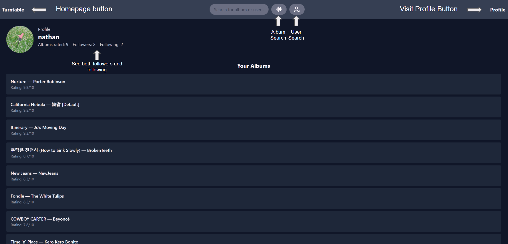
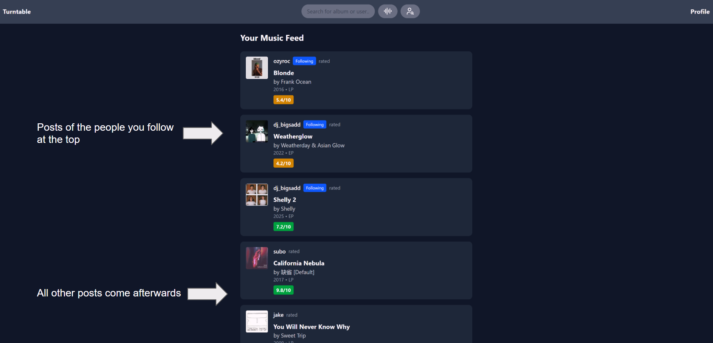
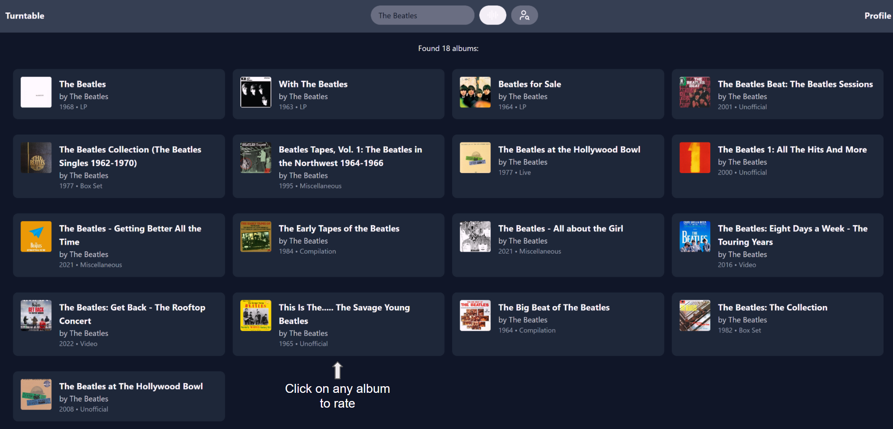

# TurnTable

## A full-stack node.js social media app that allows users to rate albums and share their ratings with friends

  Here are some of the features and technologies used to create Turntable:
  - User registration and login made using Node.js, Express, and JWT authentication for secure account management
  - Data scraping for album search made using Python and beautifulsoup scripts to fetch and update album metadata
  - Infinite scroll pagination of trending albums and recent reviews made using React.js Intersection Observer API
  - Friend system (follow/unfollow users) made using relational database tables and REST endpoints to manage user connections
  - Personalized user profiles made using React components and Tailwind CSS

## How it looks
The site is currently down and will be back up in about a week, but in the meantime, here's what it looks like

### User Profile Page

### Home Page

### Search Page

## Future edits and improvement I want to make
  - Adding changable profile pictures
  - improving home page interface to dynamically visit other user pages
  - Adding an ai that learns your music taste and recommends other albums
  - music related articles on the homepage mixed in with reviews
  - make a more consistent component ui for every album 

